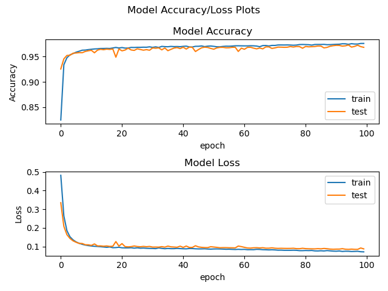

## Setup
```bash
# Creating Conda environment
conda env create -f env.yml
# Activating the environment
conda activate BioPageClassifier

# Downloading NLTK Corpora
python -m nltk.downloader all
# Downloading Word Embeddings Glove.6B
[ ! -d "glove.6B" ] && \
  wget http://nlp.stanford.edu/data/glove.6B.zip && \
  mkdir -p .glove.6B && \
  unzip glove.6B.zip -d .glove.6B && \
  rm glove.6B.zip
```

## Crawler
You can run crawler to collect negative data by running the following:
```bash
# Running Spider

$ scrapy runspider crawler.py \
  -a start_url=https://www.cnn.com/ \
  -a allowed_domain=cnn.com \
  -a db=/tmp/cnn_db.json \
  -a output=/tmp \
  -a exclude='.+?(show|business).+?'
```

## Classifier
Classifier model is saved in `bio-model`
### Accuracy / Loss Chart

### Model Architecture Chart

